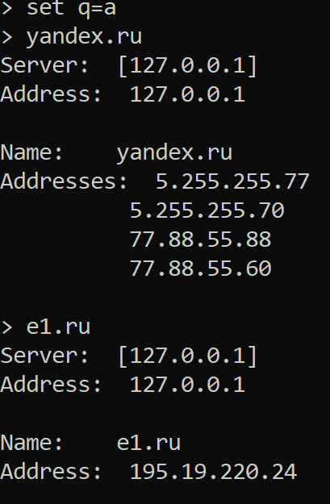
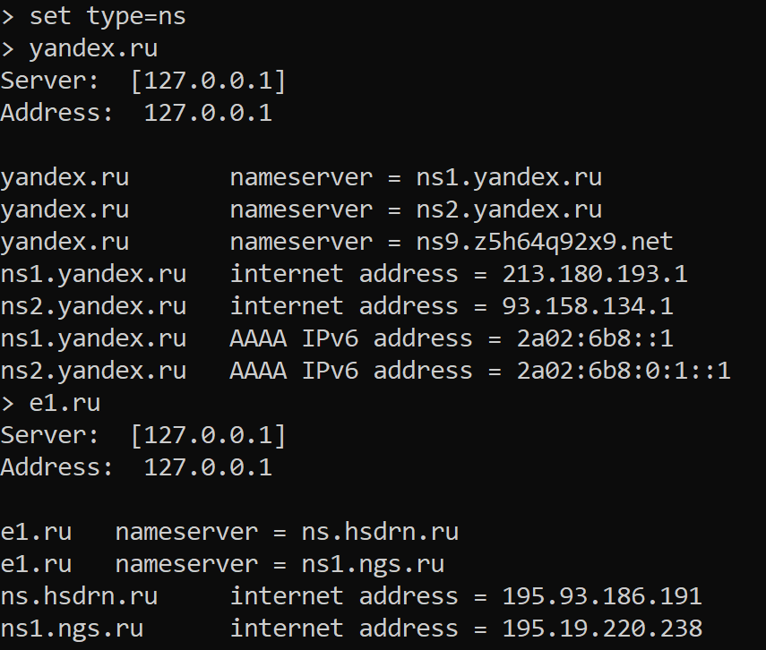

Мой не самый хороший dns сервер

Что умеет:

Разрешать запросы типа a и ns, 
если не возникает ситуации, когда в ресурсных записях нет ip

Умеет запоминать ответы и если сделать запрос, который уже был в сессии,
то вернёт прошлый ответ. Сервер хранит запрос и ответ на него. Не хранит
ресурные записи, потому что я не успела это реализовать :(

Ошибки обрабатывать не умеет. 

Примеры использования с помощью утилиты nslookup:
В nslookup:

        server 127.0.0.1
        set q=a

Далее нужно запустить main() в файле server.py

Результат запроса типа а для yandex.ru и e1.ru:

Результат запроса типа ns для yandex.ru и e1.ru:

Повторюсь, что если отключить интернет и повторить эти запросы, 
ответы придут, т.к. они сохранены. Если закрыть сессию сервера, запустить 
и без интернета запросить запросы, которые были выше, то всё упадёт,
т.к. нет записи кэша в память :(

У меня получился очень бестолковый и примитивный сервер. Я бы хотела доделать его, 
но к сожалению раньше 1 июля не смогу это сделать из-за экзаменов :(
Ещё хочу отметить, что даже на такую работу у меня ушло порядка 6 дней
