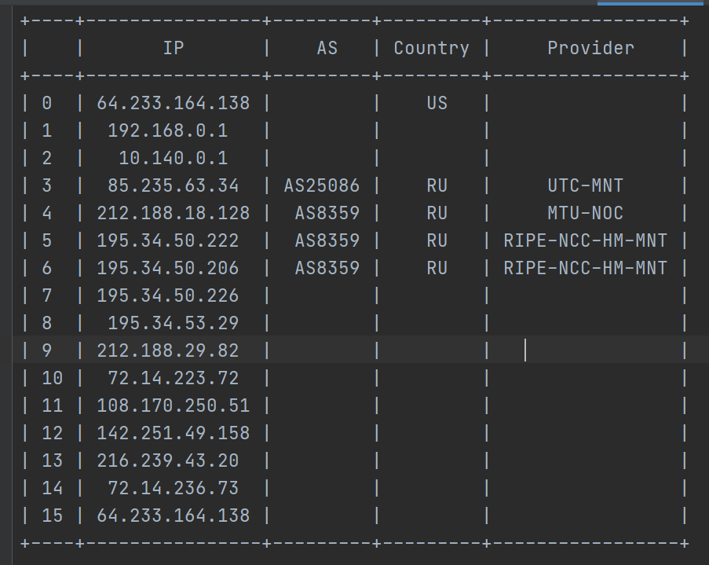
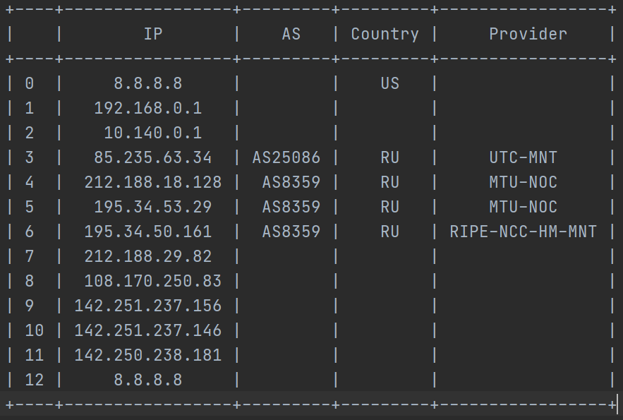
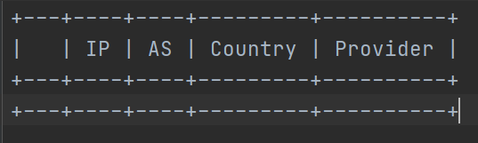

Трассировка автономных систем

Переместиться в папку trassirovka

    cd trassirovka
Перед запуском нужно установить PrettyTable командой

    pip install prettytable
чтобы табличка выводилась красиво

Запускать утилиту командой 

    python traceAS.py 'имя-домен или ip-адрес'

Подождать пока программа выполниться

В файле traceAS.txt находится таблица с ip адресами, автономными системами, странами и провайдерами

Пример:

    python traceAS.py google.com

Содержимое файла:

Пример2:
    
    python traceAS.py 8.8.8.8

Пример3:

    python traceAS.py abracadabra

